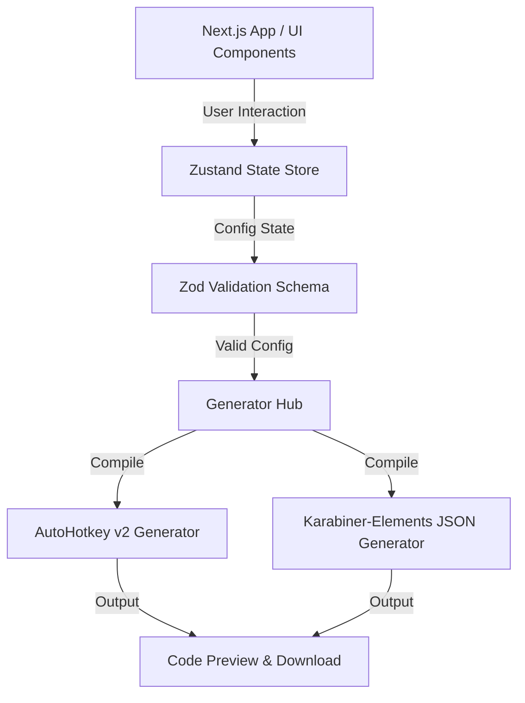
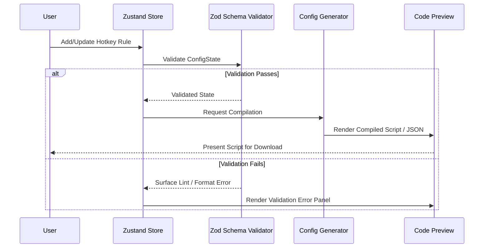

# HotkeySync

HotkeySync is a browser-based utility that generates unified configurations for AutoHotkey v2 (Windows) and Karabiner-Elements (macOS). It allows users to define keyboard shortcut remappings once in a visual interface and deploy them on either operating system to maintain a standardized keyboard experience across applications.

The application operates entirely on the client side with no backend requirements, storing configuration state in the URL as a Base64-encoded payload for sharing, and in localStorage for persistence.

## System Architecture

The following block diagram illustrates the relationship between the visual user interface, state management, validation logic, and the OS-specific compilation generators:



## Key Features

- Visual Rule Builder: Design rules to modify keyboard behavior dynamically for individual desktop applications or globally across the system.
- OS-Specific Generators: Output validated AutoHotkey v2 scripts for Windows and complex_modifications JSON for Karabiner-Elements on macOS.
- Rule Types:
  - Basic Remaps: Direct key-to-key or key-to-modifier action mapping.
  - Tap and Hold: Emits one keypress when tapped and a different action or modifier when held.
  - Disable: Swallows standard shortcuts to prevent unintended application behaviors (e.g., stopping accidental quits).
  - Hyper Layers: Activates temporary custom mapping layers (hold or one-shot toggle) that modify the behavior of subsequent keys.
- Local Simulator: Press key combinations to preview mapped behaviors interactively without installing any configuration files.
- Conflict Matrix: View a grid of standard shortcuts across applications to detect potential conflicts.
- Portable Configurations: Export configurations as URL share links (base64url encoded hash) or import existing configs.

## Data Flow

This sequence diagram details the process of creating, validating, and generating OS-specific scripts:



## Repository Structure

The project is structured as follows:

```
HotkeySync/
  ├── docs/                      - Design docs, research findings, and memory logs
  └── hotkey-sync/               - Next.js application directory
      ├── src/
      │   ├── app/               - Layouts, styling, and main entry page
      │   ├── components/        - UI components (app picker, simulator, matrix)
      │   ├── data/              - Application presets and default catalogues
      │   ├── lib/
      │   │   ├── generators/    - Compiler logic for AHK v2 and Karabiner-Elements
      │   │   ├── import/        - Code parsers for importing existing scripts
      │   │   ├── lint/          - Lint rules and syntax checkers
      │   │   └── schemas.ts     - Zod configuration and rule validation schemas
      │   ├── store/             - Zustand configuration store
      │   └── types/             - Common TypeScript interfaces
      └── tests/                 - Playwright E2E and Vitest unit tests
```

## Development and Testing

### Setup and Local Execution

To run the Next.js frontend locally:

```bash
cd hotkey-sync
nvm use 22
npm install
npm run dev
```

The application will be accessible at `http://localhost:3000`.

### Production Build

To compile a static production build:

```bash
cd hotkey-sync
npm run build
npm run start
```

### Quality Assurance

Ensure all linting, type-checking, and test suites pass before pushing updates:

```bash
cd hotkey-sync
npm run lint         # Run ESLint
npx tsc --noEmit     # Type-check TypeScript files
npx vitest run       # Run Vitest unit tests
npx playwright test  # Run Playwright E2E tests
```
